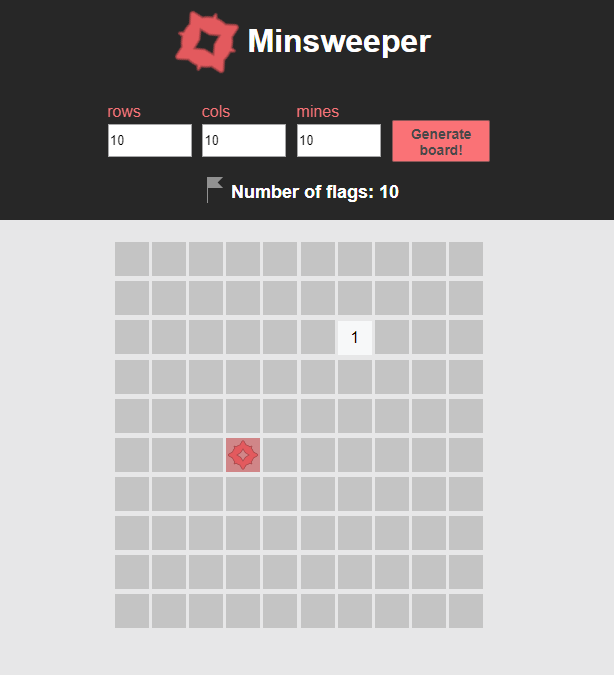

Minesweeper
===========

This project was bootstrapped with [Create React App](https://github.com/facebookincubator/create-react-app).

Enjoy minesweeping!

## Guide

Left click on an unrevealed cell will reveal it. A right click will flag it. Clicking on a mine is a "Game Over", so be careful and flag the mines. If you flag them all you win the game! Feel free to click on the "Generate board" button to restart the game :)

## Bugs & Issues

There are several known bugs and issues at this point:

* inability to manage large grids
* phone grid view
* negative amount of flags is possible (even though an alert is presented)

## Credits

Credit to [Erik Ragnar Eliasson](http://www.erikeliasson.io/) for the mine icon
Credit to [icons8](https://icons8.com/) for the mouse icons

## License

MIT